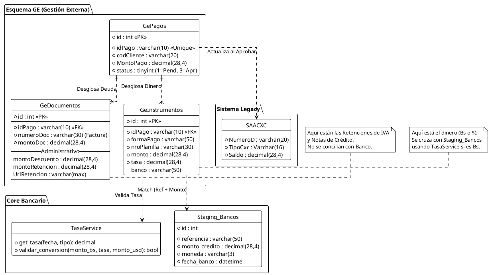

No estamos hablando de una conciliación 1 a 1 (Pago = Movimiento Bancario), sino de una **Conciliación Compuesta y Multimoneda**.

El desafío principal aquí es que **"un "Pago" reportado es una entidad financiera compuesta**, donde el dinero en el banco es solo una fracción del total que amortiza la deuda.

He diseñado el flujo lógico y el diagrama para reflejar esta realidad:

1. **Desglose del Pago:** Separar lo que es dinero real, notas de crédito y retenciones.
2. **Conversión Dinámica:** Uso de un `TasaService` para normalizar pagos en Bolívares a la moneda base, en este caso porque la moneda base es ($) antes de restar la deuda.
3. **Rutas de Efectivo:** Manejo de cajas que no tienen "estado de cuenta bancario digital" pero requieren auditoría.
4. **Seguridad:** RBAC (Control de acceso basado en roles) para el Dashboard.

Aquí tienes la propuesta técnica detallada.

### Resumen Textual del Nuevo Flujo

#### 1. **La Entrada del Vendedor (El Paquete de Pago):**
El vendedor reporta en el **Portal Insytech**. Este reporte no es un monto único, es un objeto complejo que guarda en las **Tablas Ge**. Contiene:
* **Facturas afectadas:** (Ej. #320, #256).
* **Componentes del Crédito:**
* *Movimiento Financiero:* Transferencia Banco X o Efectivo (Este es el único que busca match externo).
* *Movimiento Administrativo:* Notas de Crédito (Descuentos) y Comprobantes de Retención IVA.
* se hará consultas SQL (o via ORM) 

#### 2. **La Entrada Bancaria (Staging):**
El usuario sube los archivos (Excel/PDF/CSV). El sistema debe tener **Parsers Configurables** por banco. Estos datos van a las **Tablas Staging Bancos**. Tablas Que se deben crear porque no existen y debe haber un apartado en la configuración para asociar los bancos del portal de insystech con el código del banco de Saint ya que no son los mismos y el sistema pueda entender cuales bancos debe asociar.
* *Dato Clave:* La moneda original de la transacción (Bs o $) porque se van a manejar bancos con los dos tipos de moneda.


#### 3. **El Motor de Conciliación (El Cerebro):**
Este es el paso crítico. El motor lee el reporte de pago y bifurca la lógica:
* **Si es Administrativo (NC/Retención):** Se valida la existencia del documento y se aprueba "automáticamente" o bajo revisión manual, ya que no genera flujo de caja.
* **Si es Efectivo:** Se registra en una "Caja Virtual" (No busca en bancos, pero requiere confirmación de recepción física).
* **Si es Transferencia ($):** Busca monto exacto y referencia en Staging Bancos.
* **Si es Transferencia (Bs) [Lógica Compleja]:**
1. Busca la transacción en Staging Bancos en Bolívares.
2. Si la encuentra, invoca al **`TasaService`**. que se detalla mejor en el apartado: "Puntos Clave para tu Desarrollo" el punto 1. Lógica de Conversión


#### 4. **Cierre y Actualización (Tablas SAACXC):**
Una vez conciliado el dinero en banco + validadas las notas de crédito y retenciones:
* Se suman los tres componentes (Dinero + NC + Retenciones).
* Ese total se resta del saldo de la factura en **SAACXC** (Cuentas por Cobrar).
* *Resultado:* La factura queda pagada (saldo 0), aunque al banco entró menos dinero.


---

### Diagrama de Flujo Técnico (Mermaid)

Este diagrama es mucho más detallado y separa las capas de lógica.

```mermaid
flowchart TD
    %% Estilos
    classDef actor fill:#f9f,stroke:#333,stroke-width:2px;
    classDef process fill:#e1f5fe,stroke:#0277bd,stroke-width:2px;
    classDef db fill:#fff9c4,stroke:#fbc02d,stroke-width:2px;
    classDef logic fill:#e8f5e9,stroke:#2e7d32,stroke-width:2px,stroke-dasharray: 5 5;
    classDef secure fill:#ffebee,stroke:#c62828,stroke-width:2px;

    %% Actores
    Vendedor((Vendedor)):::actor
    Admin((Admin/Tesorero)):::actor
    
    %% SUBGRAFO 1: INGESTIÓN DE DATOS
    subgraph INGESTION [Capa de Ingesta]
        direction TB
        Portal[Portal Insytech\n(Reporte de Pago Complejo)]:::process
        Files[Archivos Bancarios\nExcel/PDF/CSV]:::process
        Parsers[Parsers por Banco]:::process
        
        Vendedor -->|Reporta: Facturas + NC + Ret + Pago| Portal
        Admin -->|Sube Estado de Cuenta| Files
        Files --> Parsers
    end

    %% SUBGRAFO 2: ALMACENAMIENTO TEMPORAL
    subgraph STAGING [Tablas Intermedias]
        GeDB[(Tablas GE\nPagos Reportados)]:::db
        BankStaging[(Tablas Staging Bancos\nTransacciones Crudas)]:::db
        ConfigTasas[(Config Tasas JSON\nTasaService)]:::db
        
        Portal --> GeDB
        Parsers --> BankStaging
    end

    %% SUBGRAFO 3: MOTOR LÓGICO (CORE)
    subgraph ENGINE [Motor de Conciliación]
        direction TB
        Splitter{¿Tipo de Componente?}:::logic
        
        %% Rama 1: Administrativos
        LogicAdmin[Validador Documentos\nNC y Retenciones]:::process
        
        %% Rama 2: Efectivo
        LogicCash[Registro Caja Virtual\n(Efectivo Bs/$)]:::process
        
        %% Rama 3: Bancos
        Matcher{¿Moneda Banco?}:::logic
        MatchUSD[Match Directo USD\nRef + Monto]:::process
        MatchBs[Match Bolívares]:::process
        Converter[Conversión Divisa\n(Bs / Tasa = USD)]:::process
        
        GeDB --> Splitter
        BankStaging --> Matcher
        
        Splitter -->|Nota Crédito / Retención| LogicAdmin
        Splitter -->|Efectivo| LogicCash
        Splitter -->|Transferencia| Matcher
        
        Matcher -->|Dólares| MatchUSD
        Matcher -->|Bolívares| MatchBs
        
        MatchBs -->|Extrae Monto Bs| Converter
        ConfigTasas -.->|Consulta Tasa| Converter
        Converter -->|Valida contra Deuda USD| MatchUSD
    end

    %% SUBGRAFO 4: RESULTADOS Y PERSISTENCIA
    subgraph RESULT [Persistencia y Cuentas por Cobrar]
        SBTRAN[(SBTRAN\nTransacciones Conciliadas)]:::db
        SAACXC[(SAACXC\nCuentas por Cobrar)]:::db
        
        LogicAdmin --> SBTRAN
        LogicCash --> SBTRAN
        MatchUSD --> SBTRAN
        
        SBTRAN -->|Suma: Dinero + NC + Ret| SAACXC
        SAACXC -->|Rebaja Saldo Factura| Final[Factura Saldada]:::process
    end

    %% SUBGRAFO 5: VISUALIZACIÓN
    subgraph FRONTEND [Dashboard & Seguridad]
        RBAC{Control de Acceso\n(RBAC)}:::secure
        DashAdmin[Dashboard Total\n(Ver Todo)]:::process
        DashUser[Dashboard Restringido\n(Solo sus pagos)]:::process
        
        SBTRAN --> RBAC
        SAACXC --> RBAC
        RBAC -->|Rol: Admin| DashAdmin
        RBAC -->|Rol: Vendedor| DashUser
    end

```

### Puntos Clave para tu Desarrollo


#### 1. Lógica de Conversión (Python `TasaService`)

En el diagrama, el nodo **"Conversión Divisa"** usará una clase "TasaService" o según se requiera en la arquitectura hexagonal que estamos usando.

* Cuando el motor detecta que el pago en `Staging Bank` es en Bolívares, debe decidir qué tasa usar.
* **Regla de Negocio:** ¿Usamos la tasa configurada en el sistema (`TasaService.get_by_key("TASA_OFICIAL")`) del día de la transacción, o usamos la tasa implícita que reportó el vendedor?
* *Recomendación:* Usar la tasa del sistema para validar. Si `Monto Bs Banco / Tasa Sistema ≈ Monto USD Deuda` (con un margen de tolerancia de céntimos), se aprueba.

#### 3. Seguridad (RBAC)

Para el Dashboard, no solo ocultes botones en el frontend. El backend debe filtrar la data:

* **Admin:** `SELECT * FROM SBTRAN`
* **Vendedor:** `SELECT * FROM SBTRAN WHERE vendedor_id = CURRENT_USER_ID`
* **Tesorero:** Puede ver montos y bancos, pero quizás no puede ver detalles de facturación comercial si no es su área.


Aquí dejo un diagrama y la explicación ajustada al esquema de base de datos actual.

---

### 1. Resumen del Flujo de Datos (Lógica Relacional)

El proceso se divide ahora claramente según las tablas:

1. **Registro (El "Paquete" de Pago):**
* Se crea **1 registro en `GePagos**` (Cabecera). Status: `1=Pendiente`.
* Se crean **N registros en `GeDocumentos**` (El "Qué" se paga): Aquí se desglosa cuánto va a cada factura, y lo más importante: **aquí se declaran las Retenciones y Descuentos (NC)**. Estos montos *reducen* la deuda en `SAACXC` pero *no* se buscan en el banco.
* Se crean **N registros en `GeInstrumentos**` (El "Cómo" se paga): Aquí está el dinero real. Se registra si fue Transferencia, Efectivo, Zelle, etc.

2. **Conciliación (El Match):**
* El motor **ignora** `GeDocumentos` para el cruce bancario (porque las retenciones no tocan el banco).
* El motor **toma** `GeInstrumentos`.
* **Si `GeInstrumentos.formaPago` == 'TRANSFERENCIA':**
* Busca en **Tablas Staging Banco**.
* **Caso Dólares:** Busca Monto Exacto + Referencia (`nroPlanilla`).
* **Caso Bolívares:** Toma el `monto` en Bs reportado. Usa la `tasa` registrada en `GeInstrumentos` (o la del sistema) para validar que la conversión sea correcta. Si el usuario reportó "Pagué 100 Bs a tasa 50 (2$)", el sistema busca en el banco 100 Bs.


3. **Cierre (Actualización):**
* Si los instrumentos coinciden con el banco  `GePagos.status` pasa a `3=Aprobado`.
* Se dispara el proceso de actualización de saldo en `SAACXC` usando la data de `GeDocumentos` (restando el pago neto + retenciones + descuentos).


---

### 2. Diagrama de Flujo del Sistema con las tabals GExxxx (Mermaid)

Este diagrama muestra cómo interactúan tus tablas específicas con el proceso.

```mermaid
flowchart TD
    %% Estilos
    classDef tables fill:#fff9c4,stroke:#fbc02d,stroke-width:2px;
    classDef system fill:#e1f5fe,stroke:#0277bd,stroke-width:2px;
    classDef logic fill:#e8f5e9,stroke:#2e7d32,stroke-width:2px,stroke-dasharray: 5 5;
    classDef manual fill:#ffebee,stroke:#c62828,stroke-width:2px;

    subgraph INPUT [Entrada de Datos]
        Vendedor([Vendedor Portal]):::manual
        GePagos[(GePagos\nCabecera Status=1)]:::tables
        GeDoc[(GeDocumentos\nFacturas, Retenciones, NC)]:::tables
        GeInst[(GeInstrumentos\nBancos, Efectivo, Tasa)]:::tables
        
        Vendedor -->|Crea Pago| GePagos
        GePagos -->|1:N| GeDoc
        GePagos -->|1:N| GeInst
    end

    subgraph BANK_INPUT [Entrada Bancaria]
        UserBank([Usuario Banco]):::manual
        Files[Excel/CSV/PDF]:::system
        Staging[(Staging Bancos\nMovimientos Reales)]:::tables
        
        UserBank -->|Carga| Files
        Files -->|Parser| Staging
    end

    subgraph ENGINE [Motor de Conciliación]
        LoopInst[Iterar GeInstrumentos]:::system
        DecisionTipo{¿Forma Pago?}:::logic
        
        %% Lógica Efectivo
        CajaVirtual[Módulo Caja\nValidación Manual]:::manual
        
        %% Lógica Banco
        DecisionMoneda{¿Moneda?}:::logic
        CalcBs[Calculadora Tasa\n(Usa TasaService)]:::system
        Match[Match con Staging\n(Ref + Monto)]:::system
        
        GeInst --> LoopInst
        Staging --> Match
        
        LoopInst --> DecisionTipo
        DecisionTipo -->|Efectivo| CajaVirtual
        DecisionTipo -->|Transferencia/Cheque| DecisionMoneda
        
        DecisionMoneda -->|Dólares| Match
        DecisionMoneda -->|Bolívares| MatchBs_Pre
        
        MatchBs_Pre[Busca en Banco (Bs)] --> CalcBs
        CalcBs -->|Valida Equivalente $| Match
    end

    subgraph OUTPUT [Resultado y Cierre]
        UpdateStatus[Update GePagos\nStatus = 3 (Aprobado)]:::system
        ApplyCxC[Aplicar a SAACXC]:::system
        
        Match -->|Match OK| UpdateStatus
        CajaVirtual -->|Aprobado| UpdateStatus
        
        UpdateStatus --> ApplyCxC
        GeDoc -.->|Data para Rebajar Deuda| ApplyCxC
        
        ApplyCxC --> Fin((Factura Saldada))
    end

```

### 3. Diagrama de Relación de Datos (PlantUML)

Este diagrama es útil para que tu equipo de desarrollo visualice cómo se relacionan las tablas que definiste en el YAML con el sistema de tasas y conciliación.



### Detalle sobre la lógica de Bolívares y Retenciones

por ejemplo en la tabla GExxxx: un posible caso hipotético se reporta un pago de 1000$ y este afecta a 2 facturas:
Factura: #320 por un monto de 700.00    
Nota Crédito =   301.72     
Retención IVA =  72.41  
Pago en banco Banesco = 325.86  
        
        
Factura: #256 Por un monto de 300.00    
Nota Crédito = 129.31   
Retención IVA = 31.03   
Pago en Banco Banesco = 139.66

Pero en realidad el dinero que llega a Banco Banesco es solo = 465.52 pero la factura Factura: #256  en tabla "SAACXC" se rebaja por el monto de 300.00 y la factura  #320 por el monto de 700.00 completamente paga pero la combinación de todo esto es variada puede haber pagos sin retenciones o solo un pago con retención que no llegaría a banco pero igual el sistema de cobranzas debe manejar todas estas variables pueden pagar en un mismo pago en un banco o en dinero en efectiv

Basado en el ejemplo de las facturas #320 y #256:

1. **En `GeDocumentos`:**
* Tendrás un registro para la Factura #320 indicando `montoRetencion = 72.41` y `montoDescuento = 301.72`.
* Tendrás otro registro para la Factura #256 indicando `montoRetencion = 31.03` y `montoDescuento = 129.31`.
* *Nota:* Estos montos ya "justifican" parte de la deuda sin necesidad de que haya dinero en el banco.


2. **En `GeInstrumentos`:**
* Tendrás un registro (probablemente único si fue una sola transferencia) por el monto total que entró al banco: **465.52**.
* Campo `banco`: "Banesco".
* Campo `moneda`: "Bs" (asumo, o si pagaron en dólares, Dólares).
* Campo `tasa`: La tasa a la que el cliente calculó esos 465.52 (si fue en Bs).


3. **El Match:**
* El sistema toma los **465.52** de `GeInstrumentos`.
* Busca en la tabla `Staging` de Banesco una entrada por ese monto (o su equivalente en Bs) con la referencia dada.
* Si encuentra el dinero  El pago es válido.


4. **La Aplicación en SAACXC:**
* El sistema suma para la Factura #320: (Parte proporcional del dinero + 72.41 Ret + 301.72 NC).
* Si la suma da 700.00, la factura queda saldada.