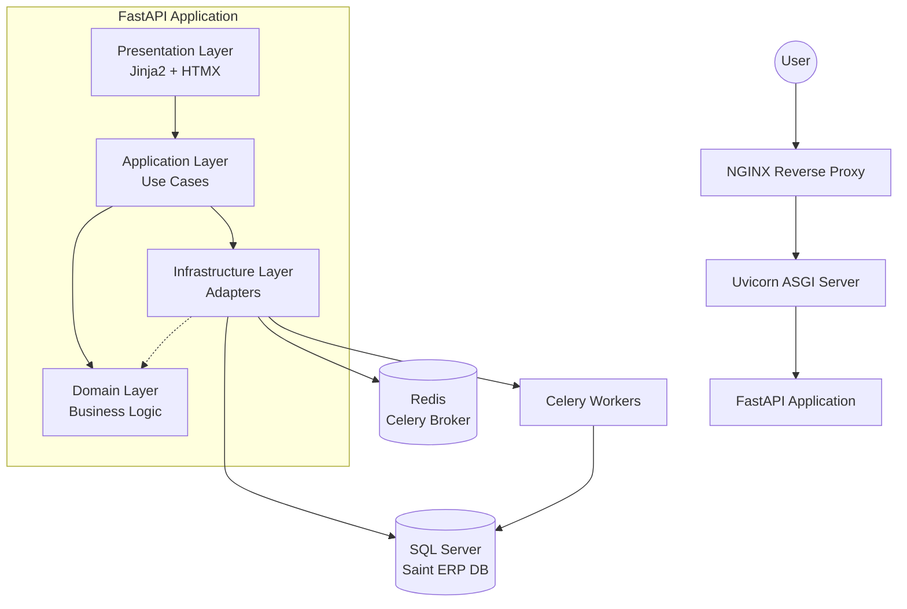

# Architecture: GeBankSaint

## System Architecture: Modular Hexagonal Monolith

We have chosen a **Modular Hexagonal Monolith** architecture to ensure consistency, simplicity, and performance while integrating with the legacy Saint ERP.



### Key Components

1.  **FastAPI Monolith (Single Process):**
    *   **Benefits:** Single database (ACID transactions), zero network latency between "services", direct SQL joins between Saint and App tables, simplified deployment.
    *   **Responsibility:** Handles all HTTP requests, business logic, and UI rendering.

2.  **Frontend (SSR + Progressive Enhancement):**
    *   **Stack:** FastAPI (Jinja2) + HTMX + Tailwind CSS.
    *   **Strategy:** Server-Side Rendering (SSR) for initial load, HTMX for partial updates and interactions. State is kept on the backend.
    *   **Benefits:** No logic duplication, native SEO, no complex frontend build step, instant hydration.

3.  **Anti-Corruption Layer (ACL) for Saint:**
    *   **Problem:** Saint has cryptic table names (`SBBANC`, `SAACXC`) and legacy logic.
    *   **Solution:** Adapter Pattern to translate between the clean Domain and Saint's schema.
    *   **Implementation:** `SaintAdapter` translates clean Domain Entities (e.g., `Pago`) into Saint's SQL tables (`SBTRAN`, `SAACXC`).

### Layered Structure

*   **Presentation Layer (UI):** Jinja2 Templates, HTMX attributes, Tailwind CSS classes.
*   **Application Layer (Use Cases):** Orchestrates logic (e.g., `ConciliarPagoUseCase`, `ValidarPagoUseCase`).
*   **Domain Layer (Business Logic):** Pure Python entities (`Pago`, `Factura`, `Cliente`), Value Objects (`Monto`, `Moneda`), and Domain Services (`MatchingService`). **No external dependencies.**
*   **Infrastructure Layer (Adapters):** Implementations of repositories, file parsers (Excel, PDF), and database connections.
    *   **Saint Adapter:** Reads `SBBANC`, `SAACXC`, `SAFACT`, `SACLIE`.
    *   **Insytech Adapter (DB-Based):** Reads `Gedocumentos`, `GeInstrumentos`, `GePagos` (tables populated by the vendor portal).

## Project Structure

```text
saint-bank-monolith/
│
├── app/
│   ├── main.py                    # Entry point FastAPI
│   ├── config.py                  # Settings (Pydantic)
│   │
│   ├── domain/                    # 🏛️ DOMAIN LAYER (Pure Business Logic)
│   │   ├── entities/              # Data structures (Pago, Factura, Cliente)
│   │   ├── value_objects/         # Value objects (Monto, Moneda)
│   │   ├── services/              # Domain services (MatchingService)
│   │   └── repositories/          # Repository Interfaces (Ports)
│   │
│   ├── application/               # 🎯 APPLICATION LAYER (Use Cases)
│   │   ├── use_cases/             # Orchestration logic (cxc, conciliacion)
│   │   └── dto/                   # Data Transfer Objects
│   │
│   ├── infrastructure/            # 🔌 INFRASTRUCTURE LAYER (Adapters)
│   │   ├── saint/                 # Saint ERP Adapters (ACL)
│   │   ├── parsers/               # File Parsers (Excel, PDF, TXT)
│   │   ├── insytech/              # External API Clients
│   │   ├── database/              # SQLAlchemy models & session
│   │   └── tasks/                 # Celery tasks
│   │
│   ├── presentation/              # 🖥️ PRESENTATION LAYER
│   │   ├── web/
│   │   │   ├── routes/            # FastAPI Routes
│   │   │   ├── templates/         # Jinja2 Templates
│   │   │   ├── forms/             # Form validation
│   │   │   └── dependencies.py    # Dependency Injection
│   │   └── api/                   # REST API (if needed)
│   │
│   └── shared/                    # 🛠️ SHARED UTILITIES
│       ├── utils/
│       ├── exceptions/
│       └── constants.py
│
├── static/                        # Static Files (CSS, JS, Images)
├── alembic/                       # Database Migrations
├── docker/                        # Docker Configuration
├── requirements/                  # Python Dependencies
└── tests/                         # Test Suite
```

## Data Flow & Integration

### Saint ERP Coexistence Strategy
1.  **Read:** The app can read all Saint tables (`SELECT`).
2.  **Write:** Write operations are strictly controlled via the **Saint Adapter** to ensure data integrity.
3.  **Schema Separation:**
    *   `dbo.*`: Saint ERP tables (Read-Heavy, Write-Careful).
    *   `AppConciliacion.*`: New application tables (Full Control).

### Background Processing
*   **Celery + Redis:** Used for heavy lifting tasks to avoid blocking the main web server.
    *   Parsing large bank statement files.
    *   Batch reconciliation algorithms (running at 3 AM).
    *   Report generation.
